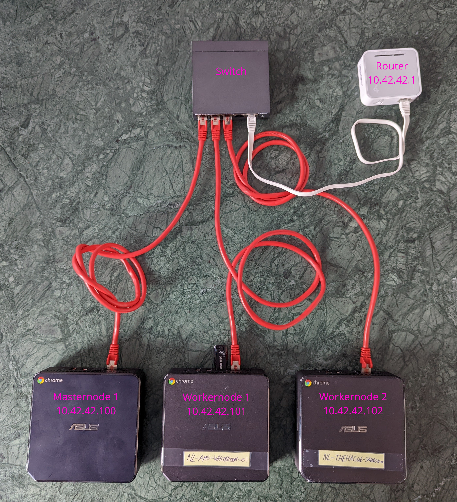

# my_k3s_cluster
Configuration of my K3s cluster

I have built an kubernetes cluster on bare-metal using K3s.

## Hardware

For the hardware setup, I followed the following guide: https://anthonynsimon.com/blog/kubernetes-cluster-raspberry-pi/

I used three used Chromeboxes as nodes. In order to use the chromeboxes for this purpose, it is necesarry that they are deprovisioned by admin of the company that used them. In order to use a different OS than the pre-installed Chrome-OS, the UEFI- Firmware must be modified. This guy has made a fantastic script to make this possible: https://mrchromebox.chrx.org/#fwscript

### Nodes

1 Master node: Asus ChromeBox N62
- Fedora 36
- 4GiB RAM
- Intel inside Core i7 (4 cores)
- 14GiB Storage

2 Worker nodes: Asus ChromeBox N62
- Fedora 36
- 4GiB RAM
- Intel inside Core i7 (4 cores)
- 14GiB Storage

### Networking

Tp-link TI-Sg1005P 5-Ort Gigabit Poe Switch

Tp-Link AC750 Mini Picket Wifi-router (installed OpenWRT firmware on it https://www.youtube.com/watch?v=LIM_2BLi91M&t=315s)

### Storage

Sandisk 128 USB 3.0

## Open WRT

1. Set router in client mode

2. Make connection to your home WiFi Network
Network > Wireless

3. Add an extra IPv4 address the LAN interface:

Now your two interfaces should look like this:

4. Make sure that the Firewall allows traffic to all zones:
Network > Firewall

5. Enable port forwarding for the k8s api endpoint and ssh

## Software

# CoreOS

With this project, I tried to 

| Purpose | Tool | Note |
|---|---|---|
| Kubernetes |  K3s |  |
| Networking |  Traefik | Default on K3s |
| GIT |  Gitea |  |
| Repository Management |  Nexus |  |
| CI/CD |  Tekton |  |
| GitOps |  ArgoCD |  |

Planned:
- Secret Management: Hashicorp Vault
- Identity Management: OpenIAM
- Monitoring/Log management: ELK Stack

